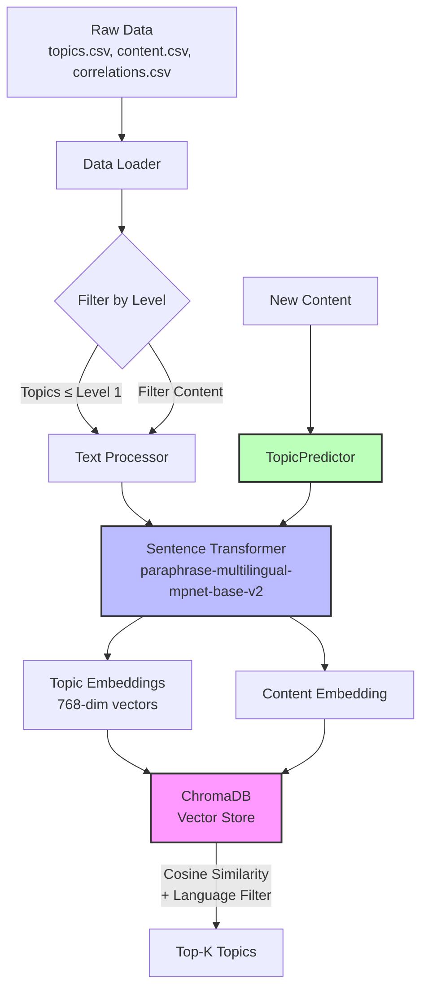

# Topic-Content Matching System

Semantic search system that matches educational content to curriculum topics using multilingual sentence embeddings and vector similarity search.

## Architecture



## Approach

### Core Strategy

Pure semantic similarity search using pre-trained multilingual embeddings. Content and topics are encoded into dense vectors, then matched via cosine similarity in vector space.

### Key Decisions

1. Vector Database over Classifier

    * Topics exceed content (76k topics, 154k content items)
    * Store topics as searchable catalog, query with content embeddings
    * No training phase required - works out of the box
    * Handles cold-start naturally

2. Topic Level Filtering

    * Dataset contains hierarchical topics (levels 0-7)
    * Filtering to level ≤ 1 reduces topics from 76k to ~1.3k
    * Improves precision by focusing on broader educational categories
    * Reduces computational load

3. Language-Aware Matching

    * Multilingual model supports 50+ languages
    * Query-time filtering ensures language consistency
    * Prevents cross-language false positives

## Project Structure

```
topic-classifier/
├── data/                   # CSV files (topics, content, correlations)
├── chroma_db/              # Vector store (generated by train.py)
├── src/
│   ├── data_loader.py
│   ├── preprocessor.py
│   └── vec_store.py
├── train.py                # Build vector store
├── predict_template.py     # TopicPredictor + evaluation
├── requirements.txt
├── README.md
├── .gitignore
└── pyproject.toml
```

## How to run it

Start here: `train.py`

* Loads data via DataLoader
* Filters topics by level
* Processes text via TextProcessor
* Builds ChromaDB collection via TopicVectorStore

Then: `predict_template.py`

* Contains TopicPredictor class (main deliverable)
* Loads ChromaDB collection
* Encodes content on-the-fly
* Returns top-K similar topics
* Includes evaluation metrics

## How to run it

Installation and setup using `uv`
```bash
uv sync
```

Train
```bash
python train.py
```

Evaluate
```bash
# default: 100 samples
python predict_template.py

# custom parameters
python predict_template.py --data_dir ./data --chroma_dir ./chroma_db --max_level 1 --n_samples 500
```

*hint: please note that max_level should be the same both in training and in predict_template.*

## Metrics

Evaluated on 500 random content items with language filtering (level ≤ 1):

| Metric | Score |
|--------|-------|
| **Precision@5** | 0.1152 |
| **Recall@5** | 0.5520 |
| **F2@5** | 0.3112 |
| **Precision@10** | 0.0624 |
| **Recall@10** | 0.5967 |
| **F2@10** | 0.2180 |

**Interpretation:**
- System finds ~55-60% of relevant topics (moderate recall)
- Only ~11% of top-5 predictions are correct (low precision)
- High false positive rate indicates semantic similarity alone is insufficient
- Performance constrained by: no training, aggressive topic filtering (76,972→1,275), multilingual complexity